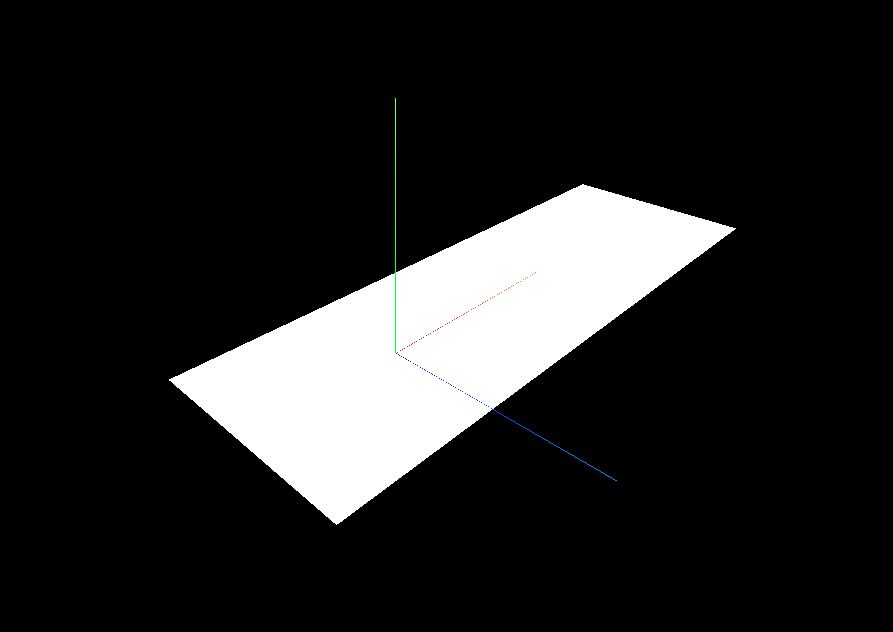

# Make a plane and a coordinate system

```javascript
const plane = new THREE.PlaneGeometry(100, 100);
const material = new THREE.MeshBasicMaterial({ color: 0xffffff });
const mesh = new THREE.Mesh(plane, material);
scene.add(mesh);
```

```javascript
const coordinateSystem = new THREE.Object3D();
scene.add(coordinateSystem);
```

```javascript
const axes = new THREE.AxesHelper(100);
coordinateSystem.add(axes);
```

```javascript
const axes = new THREE.AxesHelper(100);
coordinateSystem.add(axes);
```

# Screenshot of the web page




